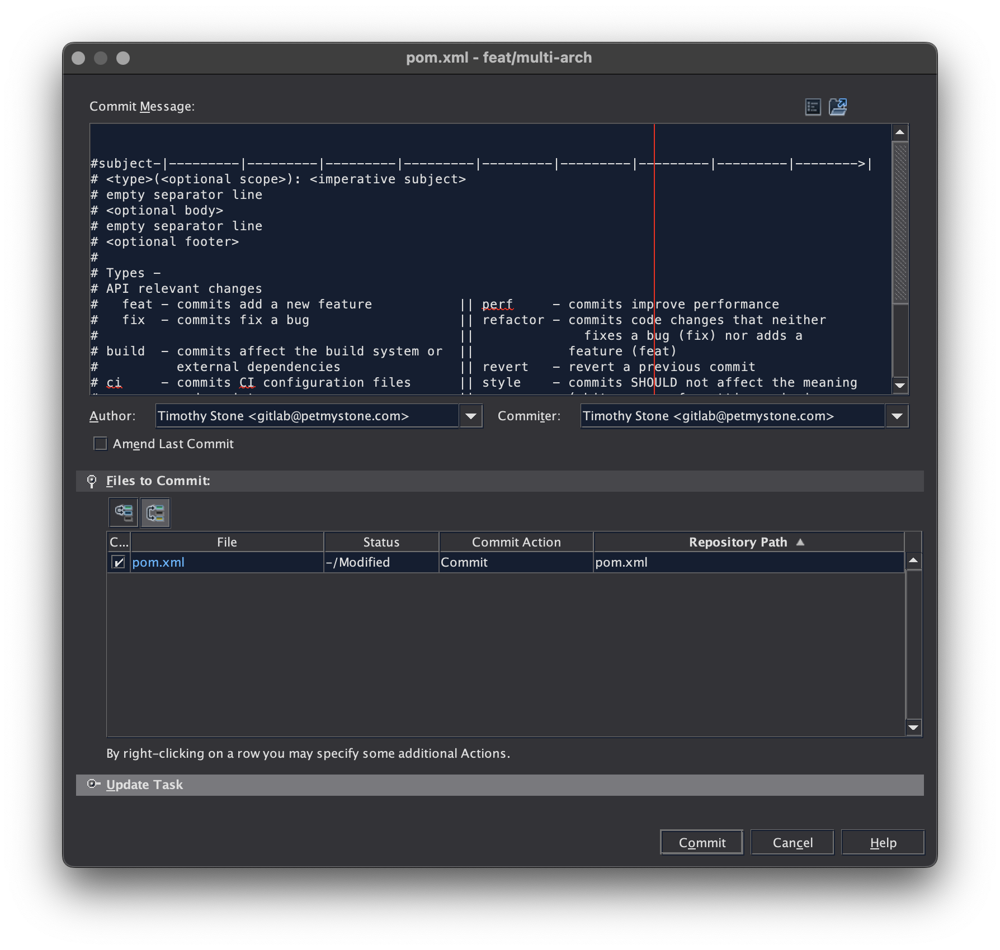
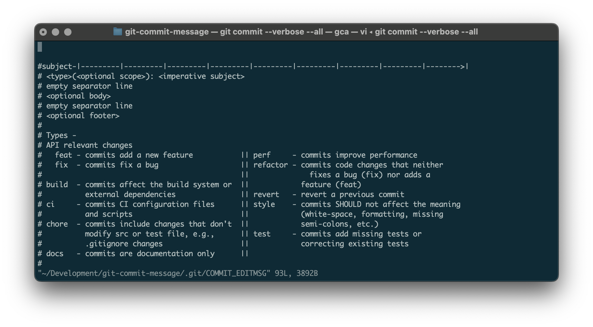

# Git Commit Message Template

The presented Git Commit Message Template is used by Git to populate one's favorite terminal, IDE, or other workflow with a helpful guide to the common Conventional Commit Specification.

```text


#subject-|---------|---------|---------|---------|---------|---------|---------|---------|-------->|
# <type>(<optional scope>): <imperative subject>
# empty separator line
# <optional body>
# empty separator line
# <optional footer>
#
# Types -
# API relevant changes
#   feat - commits add a new feature           || perf     - commits improve performance
#   fix  - commits fix a bug                   || refactor - commits code changes that neither
#                                              ||              fixes a bug (fix) nor adds a
# build  - commits affect the build system or  ||            feature (feat)
#          external dependencies               || revert   - revert a previous commit
# ci     - commits CI configuration files      || style    - commits SHOULD not affect the meaning
#          and scripts                         ||            (white-space, formatting, missing
# chore  - commits include changes that don't  ||            semi-colons, etc.)
#          modify src or test file, e.g.,      || test     - commits add missing tests or
#          .gitignore changes                  ||            correcting existing tests
# docs   - commits are documentation only      ||
#
#body and footer---|---------|---------|---------|---------|---------|---------|---------|-------->|
```

## Usage

To add this to your Git workflow, set the `commit.template` property in your Global Git Config as follows:

```bash
git config --add --global commit.template /path/to/downloaded/.gitmessage
```

The template includes the following features:

0. Every line of the template is commented thus ignored by Git on save.
1. A top "ruler" for keeping commit subjects shorter that 100 characters.
2. A table of the standard Conventional Commit types and common use cases.
3. A bottom "ruler" for keeping commit message lines shorter than 100 characters.

## IDEs

Most IDEs should pick up this setting and populate the default message. YMMV.

### Oh My ZSH

Add the `git` plugin to enjoy `git commit --all --verbose`

### vi/vim

Add an `ftplugin` customizer. 

```
cat << EOF > ~/.vim/after/ftplugin/gitcommit.vim
setlocal textwidth=100
EOF
```

This will wrap text in commit messages to 100 characters.

## Samples

### NetBeans



### vi



